# DSLUtils: A Vademecum


ewpage
# Chapter 1 — Architecture and Composition

- Namespace: `dsl`.
- Composition root: `dsl::DSL<Derived, Features...>`.
- Feature tags: `Pipeline`, `Operators`, `PatternMatch`, `AST`, `Rewrite`, `ExprTemplates`, `CustomLiterals`, `Memoization`, `LazyFeature`, `Monadic`, `ResultFeature`, `CombinatorParser`, `TaskPipeline`.
- Mixin form: each feature exposes `template <typename Derived> struct Mixin`.
- Constraint surface: `HasFeature`, `Pipeable`, `ExprLike`, `HasLiterals`, `Rewritable`.

```dot[UML]
digraph UML {
  rankdir=BT;
  node [shape=record,fontname="Arial"];
  DSL [label="{DSL<Derived, Features...>|CRTP aggregator}"];
  Pipeline [label="{Pipeline|Mixin<Derived>}"];
  Operators [label="{Operators|Mixin<Derived>}"];
  PatternMatch [label="{PatternMatch|Mixin<Derived>}"];
  AST [label="{AST|Mixin<Derived>}"];
  Rewrite [label="{Rewrite|Mixin<Derived>}"];
  ExprTemplates [label="{ExprTemplates|Mixin<Derived>}"];
  CustomLiterals [label="{CustomLiterals|Mixin<Derived>}"];
  Memoization [label="{Memoization|Mixin<Derived>}"];
  LazyFeature [label="{LazyFeature|Mixin<Derived>}"];
  Monadic [label="{Monadic|Mixin<Derived>}"];
  ResultFeature [label="{ResultFeature|Mixin<Derived>}"];
  CombinatorParser [label="{CombinatorParser|Mixin<Derived>}"];
  TaskPipeline [label="{TaskPipeline|Mixin<Derived>}"];
  Pipeline -> DSL; Operators -> DSL; PatternMatch -> DSL; AST -> DSL;
  Rewrite -> DSL; ExprTemplates -> DSL; CustomLiterals -> DSL;
  Memoization -> DSL; LazyFeature -> DSL; Monadic -> DSL;
  ResultFeature -> DSL; CombinatorParser -> DSL; TaskPipeline -> DSL;
}
```


ewpage
# Chapter 2 — Pipeline and Predicate Algebra

- Stage carrier: `PipeStage<F>`.
- Factory: `pipe(f)`.
- Value flow: `value | pipe(f1) | pipe(f2)`.
- Predicate carrier: `Predicate<F>`.
- Boolean composition: `operator&`, `operator|`, `operator!`.
- Predicate factory: `predicate(f)`.

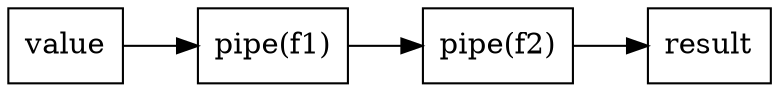


ewpage
# Chapter 3 — Pattern Matching

- Clause constructors: `when<Key>(handler)`, `otherwise(handler)`.
- Dispatcher: `match(clauses...)` producing `MatchTable`.
- Supports value keys and `pattern<...>` regex-like keys.

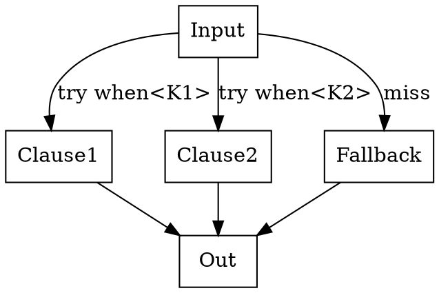


ewpage
# Chapter 4 — AST Model

- Feature: `AST`.
- Constructors: `leaf<"tag">(value)`, `node<"tag">(children...)`.
- Output support: structural dumps.

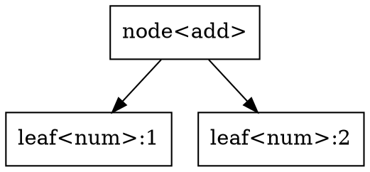


ewpage
# Chapter 5 — Rewrite Engine

- Rule constructor: `rule<"id">(predicate, transformer)`.
- Set constructor: `rewrite_set(rules...)` -> `RewriteSet`.
- Execution: repeated apply to fixpoint.

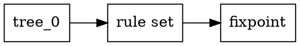


ewpage
# Chapter 6 — Expression Templates

- Terminals: `ExprTerminal`.
- Composite nodes: `BinExpr<Op,L,R>`, `UnaryExpr<Op,E>`.
- Mixin: `ExprTemplates`.

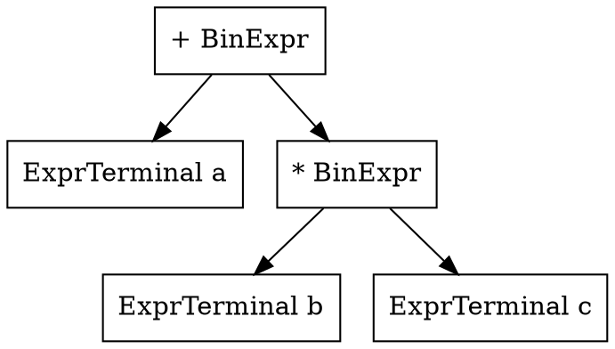


ewpage
# Chapter 7 — Custom Literals

- Entry constructor: `lit<"_suffix">(handler)`.
- Registry constructor: `literal_set(entries...)` -> `LiteralSet`.
- Parse API: `parse_literal(input)` when `Derived::literals` exists.

```dot[graph]
digraph G {
  rankdir=LR;
  node [shape=box];
  S [label=""3.5_km""];
  Split [label="numeric/suffix split"];
  Scan [label="LiteralSet scan"];
  H [label="handler"];
  R [label="long double"];
  S -> Split -> Scan -> H -> R;
}
```


ewpage
# Chapter 8 — Memoization and Lazy

- `MemoizedCallable<Key, Value, Fn>` caches via `std::unordered_map`.
- Constructor helper: `memoize<Key, Value>(fn)`.
- Invalidation: `clear_cache()`.
- `Lazy<T>` defers single computation and caches the value.

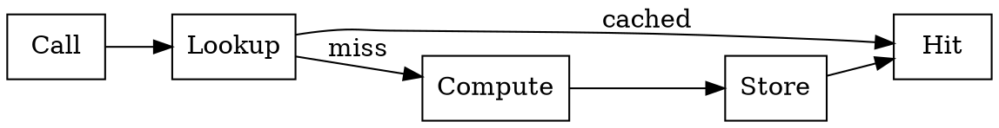


ewpage
# Chapter 9 — Monadic Optional and Result

- Optional monads: `Maybe<T>`, `map`, `flat_map`, `filter`, `or_else`.
- Result monad: `Result<T,E>` with `map`, `map_err`, `and_then`.
- Constructors: `from_ok`, `from_err`, wrappers `Ok`, `Err`.

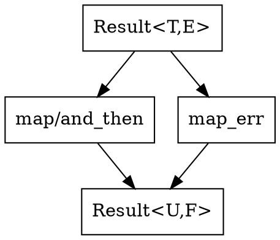


ewpage
# Chapter 10 — Combinator Parser Core

- Input carrier: `ParsecInput { source, pos }`.
- Primitive ops: `peek`, `consume`, `eof`, `get_span`.
- Parser type: `Parser<T>` wrapping `ExpectedResult<T>(ParsecInput&)`.
- Constructor: `parser(fn)`.

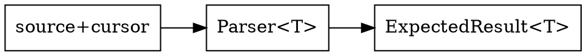


ewpage
# Chapter 11 — Parser DSL and Semantics

- Choice: `p1 | p2`.
- Sequence: `p1 & p2`.
- Repetition: `*p`.
- Optional: `optional(p)`.
- Semantic metadata: `ParserStage`.
- Handler registration: `production<"id">(fn)`.
- Action pass: `parse_with_action(...)`.

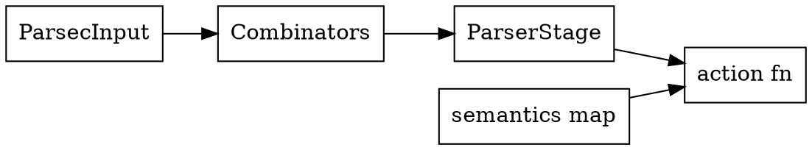


ewpage
# Chapter 12 — Task Pipeline

- State: `TaskState`.
- Unit: `Task`.
- Sequence: `TaskChain`.
- Policy: `TaskPolicy::{StopOnError, ContinueOnError}`.
- Composition: `Task | Task`, `TaskChain | Task`.
- Execution: `run(state, chain, ...)`, `suspend(state)`, `upon(state, event, task)`.

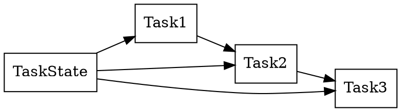


ewpage
# Chapter 13 — Integration Patterns

- Parse -> AST -> Rewrite -> Evaluate.
- `Result<T,E>` as semantic/error boundary.
- `Lazy` for deferred heavy state, `MemoizedCallable` for pure subproblems.
- `TaskChain` for post-parse execution pipelines.

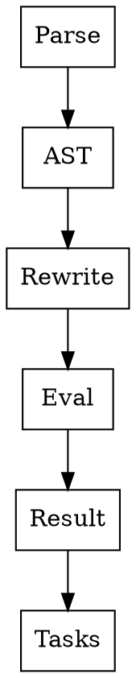

- Example anchors: `examples/awk-parser.cpp`, `examples/01-memoization.cpp`, `examples/06-task-pipeline.cpp`.


ewpage
# Chapter 14 — Build and Publishing

- Manifest-driven ordering and metadata from `manifest.yaml`.
- `build.rb` targets: `pandoc`, `manpages`, `custom`, `check`.
- Toolchain assumptions: `pandoc`, optional `dot`, optional post-hook.

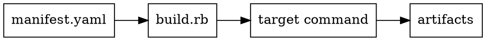
