# Chapter 1 — Architecture and Composition

- Namespace: `dsl`.
- Composition root: `dsl::DSL<Derived, Features...>`.
- Feature tags: `Pipeline`, `Operators`, `PatternMatch`, `AST`, `Rewrite`, `ExprTemplates`, `CustomLiterals`, `Memoization`, `LazyFeature`, `Monadic`, `ResultFeature`, `CombinatorParser`, `TaskPipeline`.
- Mixin form: each feature exposes `template <typename Derived> struct Mixin`.
- Constraint surface: `HasFeature`, `Pipeable`, `ExprLike`, `HasLiterals`, `Rewritable`.

```dot[UML]
digraph UML {
  rankdir=BT;
  node [shape=record,fontname="Arial"];
  DSL [label="{DSL<Derived, Features...>|CRTP aggregator}"];
  Pipeline [label="{Pipeline|Mixin<Derived>}"];
  Operators [label="{Operators|Mixin<Derived>}"];
  PatternMatch [label="{PatternMatch|Mixin<Derived>}"];
  AST [label="{AST|Mixin<Derived>}"];
  Rewrite [label="{Rewrite|Mixin<Derived>}"];
  ExprTemplates [label="{ExprTemplates|Mixin<Derived>}"];
  CustomLiterals [label="{CustomLiterals|Mixin<Derived>}"];
  Memoization [label="{Memoization|Mixin<Derived>}"];
  LazyFeature [label="{LazyFeature|Mixin<Derived>}"];
  Monadic [label="{Monadic|Mixin<Derived>}"];
  ResultFeature [label="{ResultFeature|Mixin<Derived>}"];
  CombinatorParser [label="{CombinatorParser|Mixin<Derived>}"];
  TaskPipeline [label="{TaskPipeline|Mixin<Derived>}"];
  Pipeline -> DSL; Operators -> DSL; PatternMatch -> DSL; AST -> DSL;
  Rewrite -> DSL; ExprTemplates -> DSL; CustomLiterals -> DSL;
  Memoization -> DSL; LazyFeature -> DSL; Monadic -> DSL;
  ResultFeature -> DSL; CombinatorParser -> DSL; TaskPipeline -> DSL;
}
```

