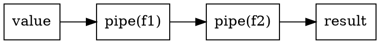

# Chapter 2 — Pipeline and Predicate Algebra

- Stage carrier: `PipeStage<F>`.
- Factory: `pipe(f)`.
- Value flow: `value | pipe(f1) | pipe(f2)`.
- Predicate carrier: `Predicate<F>`.
- Boolean composition: `operator&`, `operator|`, `operator!`.
- Predicate factory: `predicate(f)`.

