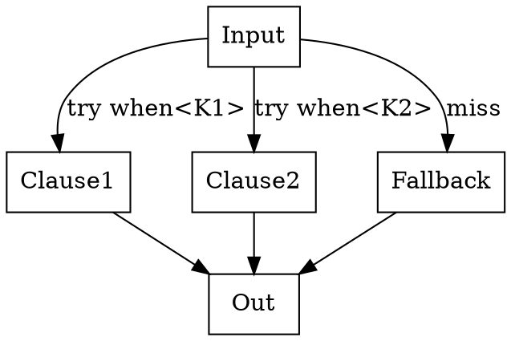

# Chapter 3 — Pattern Matching

- Clause constructors: `when<Key>(handler)`, `otherwise(handler)`.
- Dispatcher: `match(clauses...)` producing `MatchTable`.
- Supports value keys and `pattern<...>` regex-like keys.

