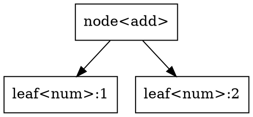

# Chapter 4 — AST Model

- Feature: `AST`.
- Constructors: `leaf<"tag">(value)`, `node<"tag">(children...)`.
- Output support: structural dumps.

```dot[graph]
digraph G {
  node [shape=box];
  Add [label="node<add>"];
  N1 [label="leaf<num>:1"];
  N2 [label="leaf<num>:2"];
  Add -> N1;
  Add -> N2;
}
```
