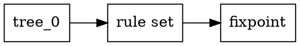

# Chapter 5 — Rewrite Engine

- Rule constructor: `rule<"id">(predicate, transformer)`.
- Set constructor: `rewrite_set(rules...)` -> `RewriteSet`.
- Execution: repeated apply to fixpoint.

```dot[graph]
digraph G {
  rankdir=LR;
  node [shape=box];
  T0 [label="tree_0"];
  R [label="rule set"];
  FP [label="fixpoint"];
  T0 -> R -> FP;
}
```
