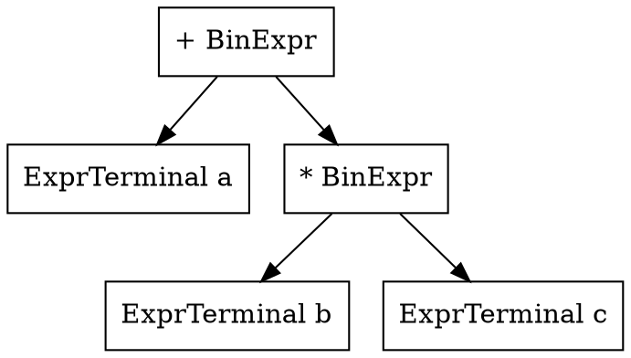

# Chapter 6 — Expression Templates

- Terminals: `ExprTerminal`.
- Composite nodes: `BinExpr<Op,L,R>`, `UnaryExpr<Op,E>`.
- Mixin: `ExprTemplates`.

```dot[graph]
digraph G {
  rankdir=TB;
  node [shape=box];
  Root [label="+ BinExpr"];
  A [label="ExprTerminal a"];
  Mul [label="* BinExpr"];
  B [label="ExprTerminal b"];
  C [label="ExprTerminal c"];
  Root -> A; Root -> Mul; Mul -> B; Mul -> C;
}
```
