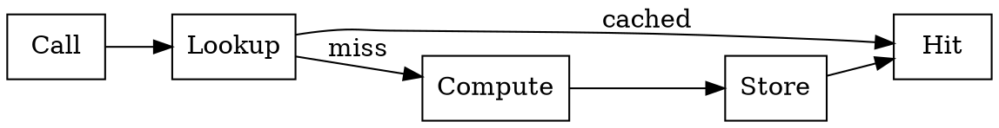

# Chapter 8 — Memoization and Lazy

- `MemoizedCallable<Key, Value, Fn>` caches via `std::unordered_map`.
- Constructor helper: `memoize<Key, Value>(fn)`.
- Invalidation: `clear_cache()`.
- `Lazy<T>` defers single computation and caches the value.

