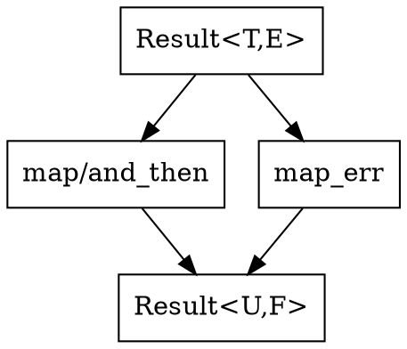

# Chapter 9 — Monadic Optional and Result

- Optional monads: `Maybe<T>`, `map`, `flat_map`, `filter`, `or_else`.
- Result monad: `Result<T,E>` with `map`, `map_err`, `and_then`.
- Constructors: `from_ok`, `from_err`, wrappers `Ok`, `Err`.

