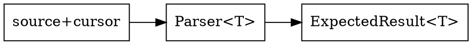

# Chapter 10 — Combinator Parser Core

- Input carrier: `ParsecInput { source, pos }`.
- Primitive ops: `peek`, `consume`, `eof`, `get_span`.
- Parser type: `Parser<T>` wrapping `ExpectedResult<T>(ParsecInput&)`.
- Constructor: `parser(fn)`.

