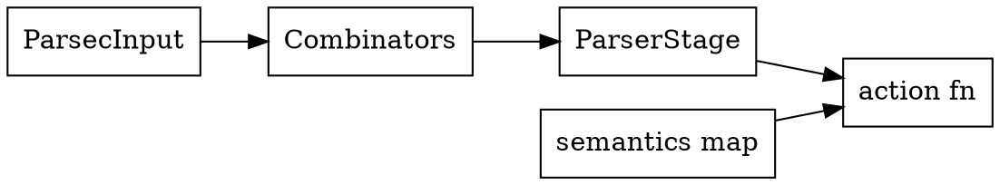

# Chapter 11 — Parser DSL and Semantics

- Choice: `p1 | p2`.
- Sequence: `p1 & p2`.
- Repetition: `*p`.
- Optional: `optional(p)`.
- Semantic metadata: `ParserStage`.
- Handler registration: `production<"id">(fn)`.
- Action pass: `parse_with_action(...)`.

