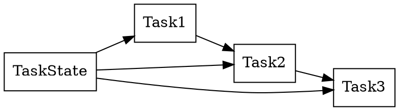

# Chapter 12 — Task Pipeline

- State: `TaskState`.
- Unit: `Task`.
- Sequence: `TaskChain`.
- Policy: `TaskPolicy::{StopOnError, ContinueOnError}`.
- Composition: `Task | Task`, `TaskChain | Task`.
- Execution: `run(state, chain, ...)`, `suspend(state)`, `upon(state, event, task)`.

