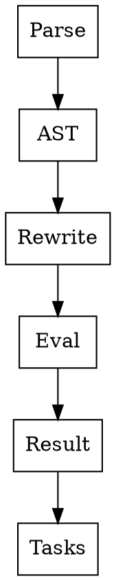

# Chapter 13 — Integration Patterns

- Parse -> AST -> Rewrite -> Evaluate.
- `Result<T,E>` as semantic/error boundary.
- `Lazy` for deferred heavy state, `MemoizedCallable` for pure subproblems.
- `TaskChain` for post-parse execution pipelines.

- Example anchors: `examples/awk-parser.cpp`, `examples/01-memoization.cpp`, `examples/06-task-pipeline.cpp`.
