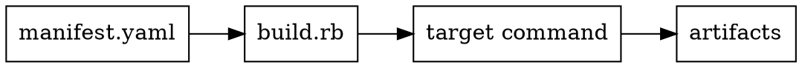

# Chapter 14 — Build and Publishing

- Manifest-driven ordering and metadata from `manifest.yaml`.
- `build.rb` targets: `pandoc`, `manpages`, `custom`, `check`.
- Toolchain assumptions: `pandoc`, optional `dot`, optional post-hook.

